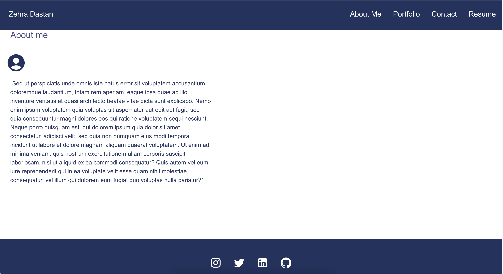
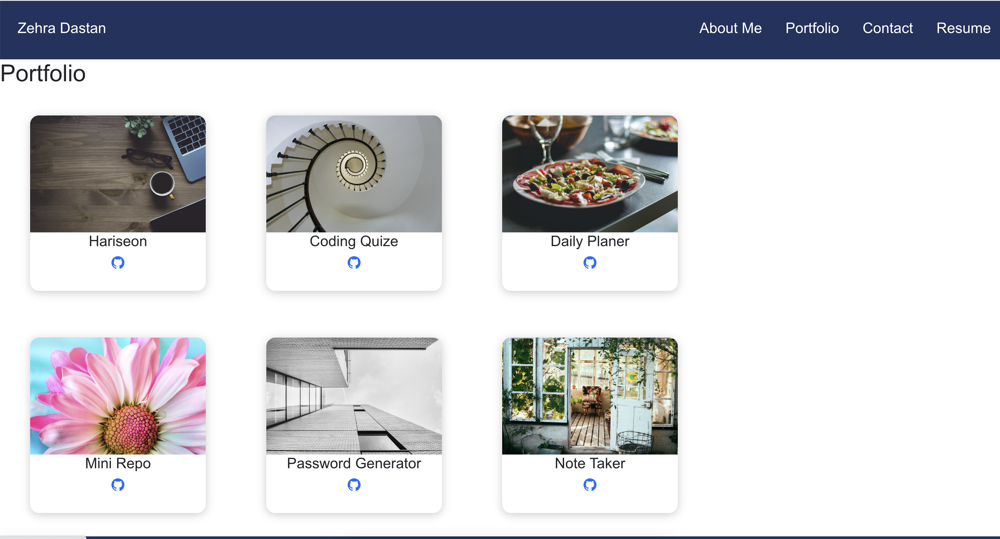
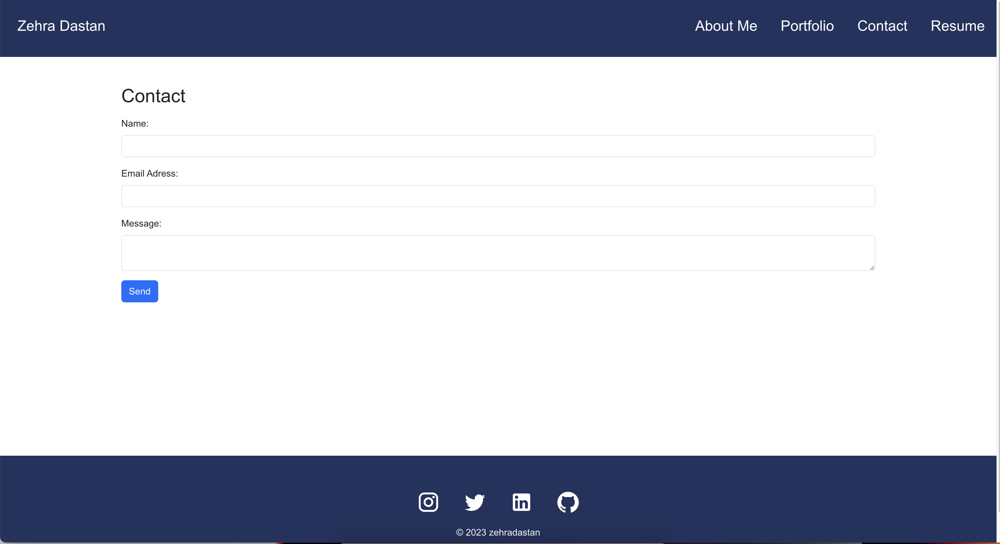
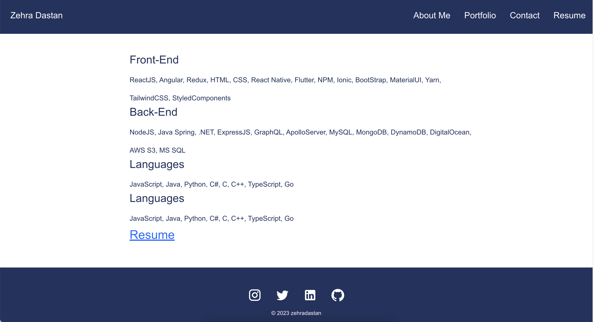

# React Portfolio

## Description

This is React Portfolio, You can see About Me, Portfolio, Contact and Resume about my work.
This created to show employes to asses my work if good to get an open position.

## Installation
To install necessary dependencies, run the following command:

Navigate to cd my-portfolio

npm install

## Usage

To use the application from the command line (after installing dependencies):

Open the root directory of the repository in your terminal or bash. Bundle the front-end code by entering npm run build in the command line. Start the server by entering npm run start in the command line.

 https://github.com/ZDastan/react-portfolio

